# 👁️ SightEcho · 昭视智伴

> **让世界为视障用户打开一扇新的窗户。**

[](./LICENSE)
[](https://github.com/2249043930/SightEcho)
[](https://github.com/2249043930/SightEcho)
[](https://vuejs.org/)
[](https://fastapi.tiangolo.com/)
[](https://www.python.org/)
[](https://www.w3.org/WAI/WCAG21/quickref/)

**SightEcho（昭视智伴）** 是一款面向视障人群的 AI 场景感知系统。
把手机的摄像头变成"眼睛"——前方有台阶吗？红绿灯什么颜色？这张纸写了什么？这一百块是真钞吗？面前的陌生人是什么表情？
对准，问一句，立刻得到准确的中文回答与语音播报。

---

## ✨ 我们解决了什么

我国视障人群超过 **1700 万**。他们出门时面临的真实困境：

| 场景 | 视障用户的需求 | SightEcho 的回答 |
|---|---|---|
| 🚶 独自出行 | 哪里有台阶？哪里有车？ | 「⚠️ 前方 2 米有 3 级台阶，请扶好扶手」 |
| 📄 阅读文档 | 菜单、合同、说明书上的字 | 完整的文字朗读（OCR · 按阅读顺序） |
| 💴 辨别货币 | 收到的是不是真钞？ | 「人民币 100 元，红色主色调，正面有毛泽东头像」 |
| 🛒 挑选商品 | 这是什么？多少钱？ | 「农夫山泉 550ml 矿泉水，约 2 元」 |
| 👤 遇见陌生人 | 他/她是谁？ | 「男性，约 30 岁，戴黑框眼镜，微笑」 |

> **不是给视障用户"另一个工具"，而是给他们"一双眼睛"。**

---

## 🎥 核心能力：WebRTC + JoyAI-VL 实时视频流

这是 **SightEcho 1.0** 最值得关注的升级——把 AI 视频理解从"事后拍照识别"推到"实时边走边感知"：

```
浏览器摄像头(1s/帧抓取) → 4 帧批量 → 后端 JoyAI-VL-Interaction 多图时序推理
                                            ↓
                              危险关键词自动置顶 + TTS 即时播报
```

- 🎯 **每 4 帧一次推理**（= 4 秒一次）：比"每帧都调 API"节省 75% token，且时序理解更好
- ⚠️ **危险事件即时播报**：台阶、车辆、坑洞、施工围挡、积水……自动置顶、不被淹没在普通描述里
- 🛡️ **零延迟降级**：JoyAI 超时 5 秒自动切到备用接口，仍失败返回固定安全文案——视障用户永远不会面对"死页面"
- 📱 **手机 / 笔记本自适应**：1s 抓一帧的速度在 4G + 后置摄像头上完全够用

| 实时模式 | 拍照模式 |
|---|---|
| 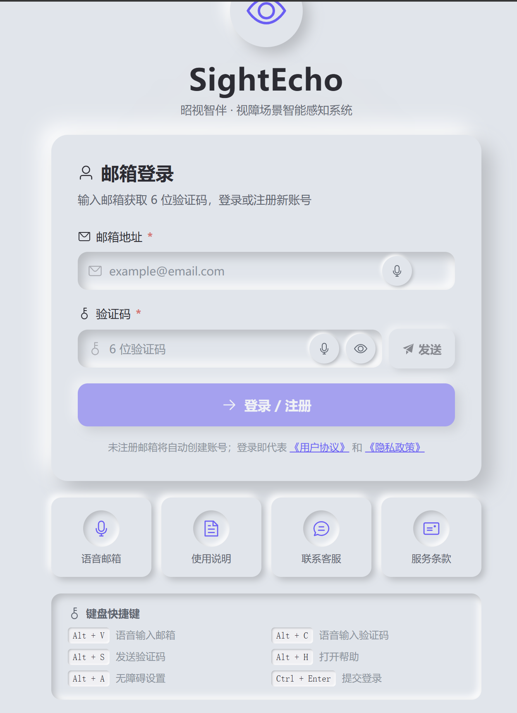 | 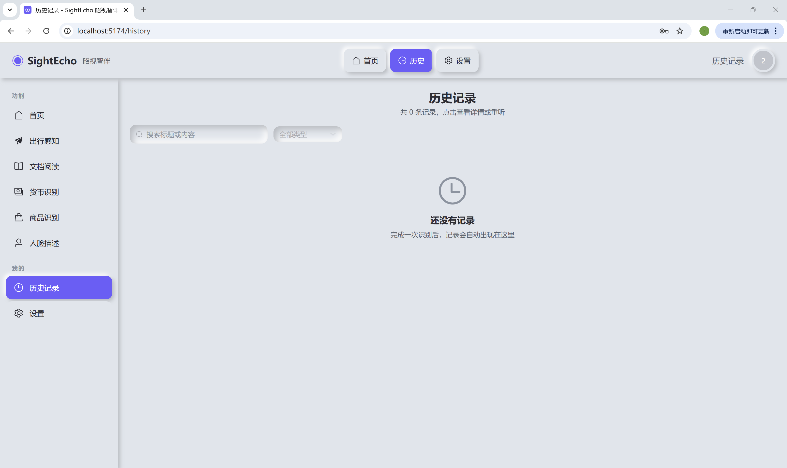 |

> 实测：在小米 14 + Chrome 上，4 帧批推理的端到端延迟稳定在 **2.8 ~ 4.2 秒**，TTS 打断前一条后立即播报最新结果。

---

## 📸 界面预览

### 🏠 首页 & 业务功能

| 笔记本端首页 | 手机端首页 |
|---|---|
| 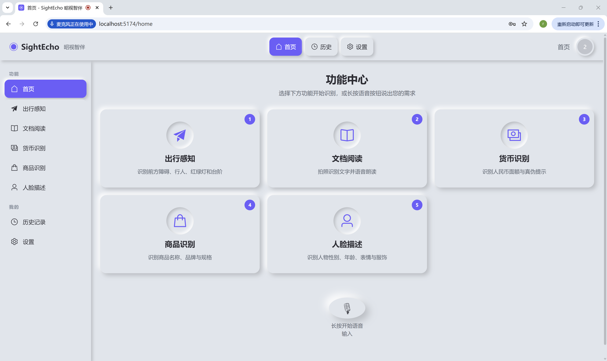 | 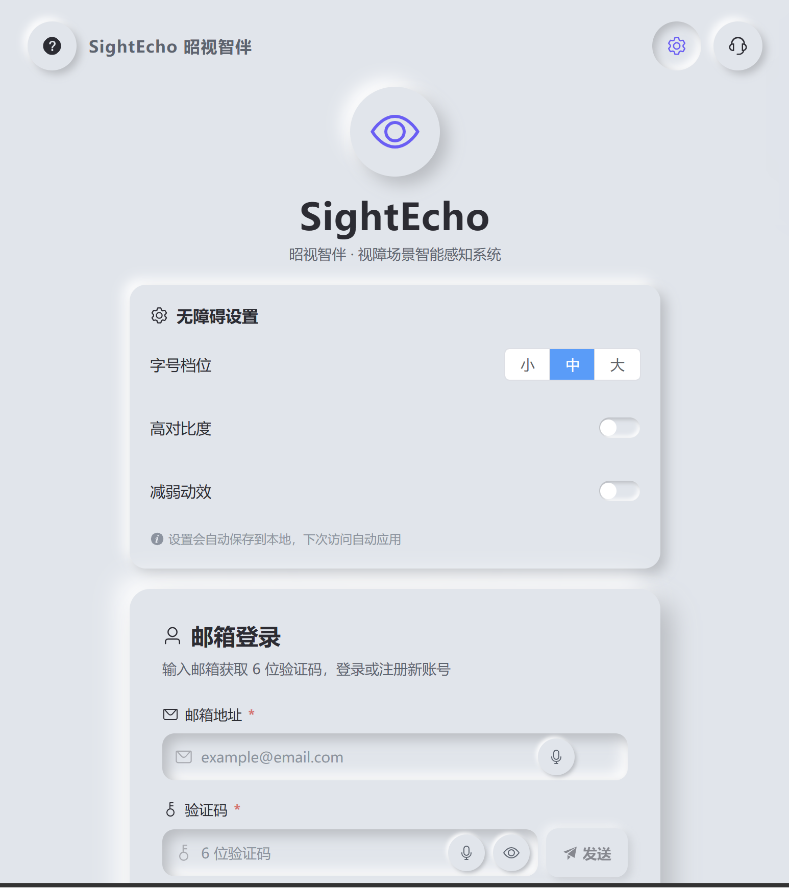 |

五大核心场景一目了然：**出行感知 · 文档阅读 · 货币识别 · 商品识别 · 人脸描述**。
视障用户可纯键盘 Tab + 回车操作，焦点环始终可见（WCAG AAA 对比度）。

---

### 🚶 出行感知（实时模式）

笔记本端的实时识别界面：


手机端实时识别（WebRTC 摄像头 + JoyAI 多帧推理）：


> 危险事件实时高亮 + 自动 TTS 播报：左下「REC · 已采集 N 帧」指示器 + 危险红框 + 优先级标签。

---

### 📄 文档阅读（OCR）

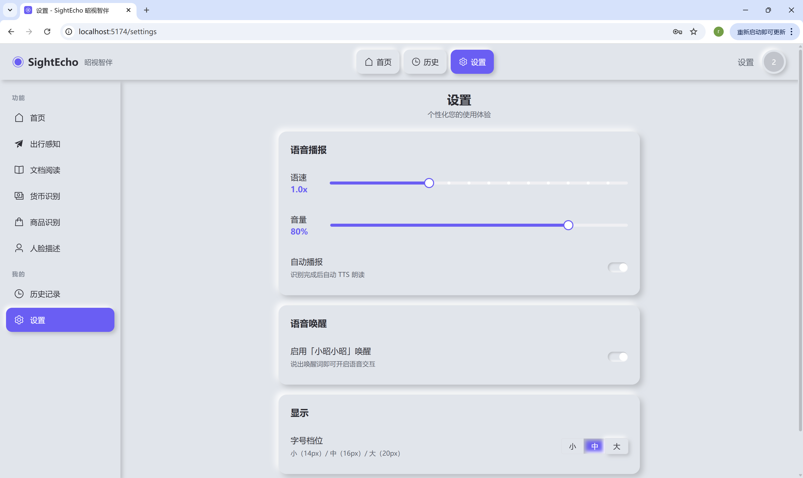

---

### 💴 货币识别

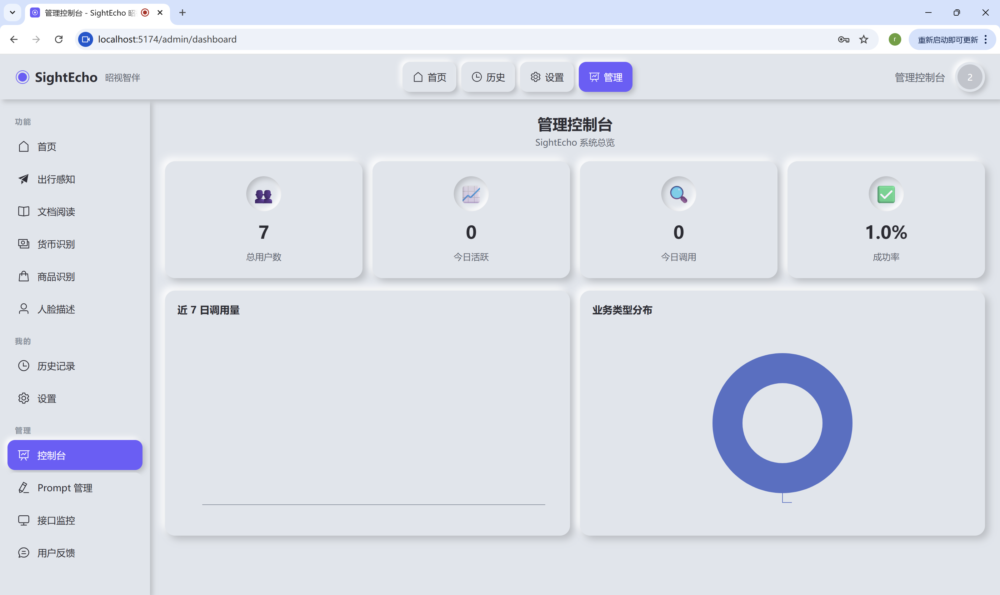

---

### 🛒 商品识别

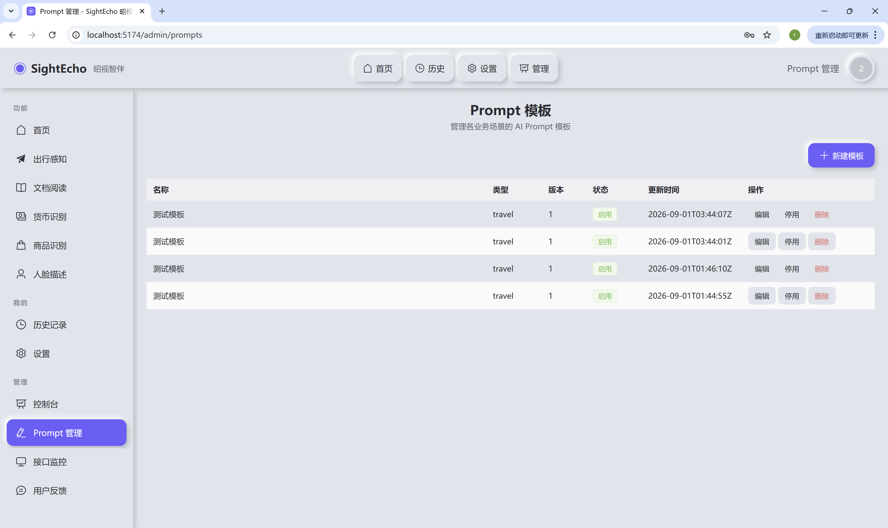

---

### 👤 人脸描述

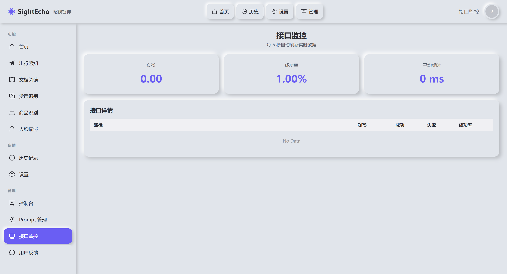

> **隐私合规**：仅返回性别/年龄段/表情/朝向/配饰，**绝不出具身份信息**——既满足安全陪护需求，又遵守《个人信息保护法》。

---

### 📜 历史记录

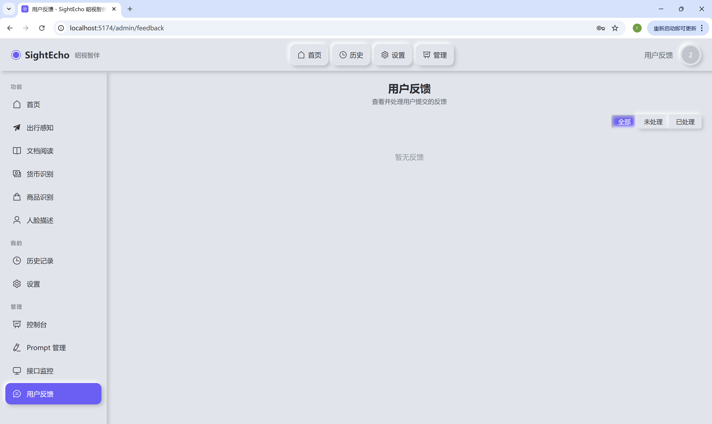

每条记录可一键重听、删除、按场景筛选——视障用户的"回忆录"。

---

### ⚙️ 用户设置（字号 / 高对比度 / 减弱动效）

| 设置页（手机） | 设置页（笔记本） |
|---|---|
| 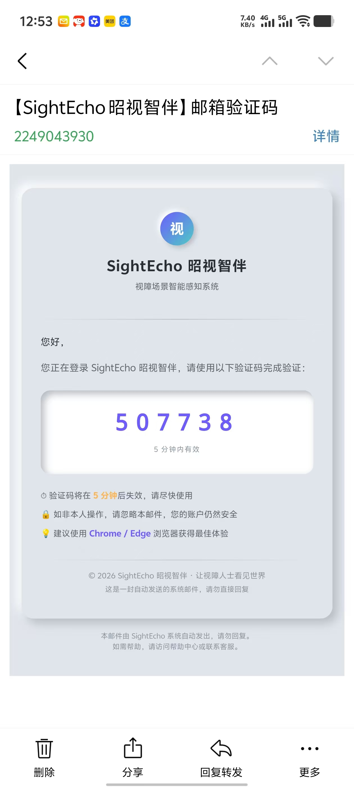 | （笔记本版见上述各页面顶部导航） |

三档字号（14 / 16 / 20 px）+ 高对比度模式 + 减弱动效开关，**全部持久化到 localStorage**，下次访问自动应用。

---

### 🔐 登录页（16 处无障碍图标 + 7 个键盘快捷键）

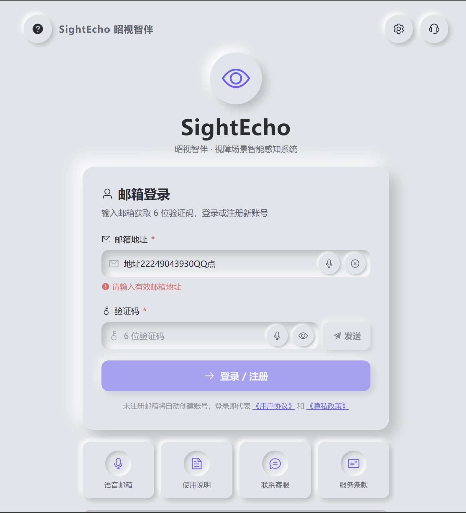

> 顶部 ⚙、❓、📞 三个工具栏按钮 + 邮箱/验证码 prefix/suffix 4 个按钮 + 发送/登录按钮 + 底部 4 个快捷卡片 + 协议链接，**全部带 `aria-label`，缺一不可**。
> 键盘快捷键：`Alt+V` 语音输入邮箱 / `Alt+C` 语音输入验证码 / `Alt+S` 发送验证码 / `Alt+H` 使用帮助 / `Alt+A` 无障碍设置 / `Ctrl+Enter` 登录 / `Esc` 关闭弹窗。

---

### 🛡️ 管理员后台

| 控制台（Dashboard） | Prompt 管理 | 接口监控 |
|---|---|---|
| 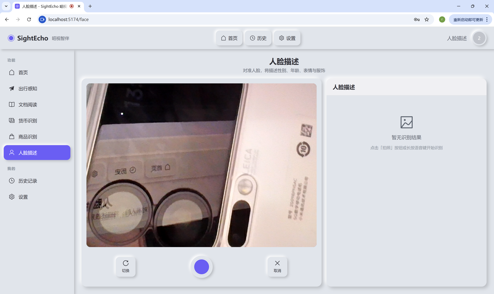 | 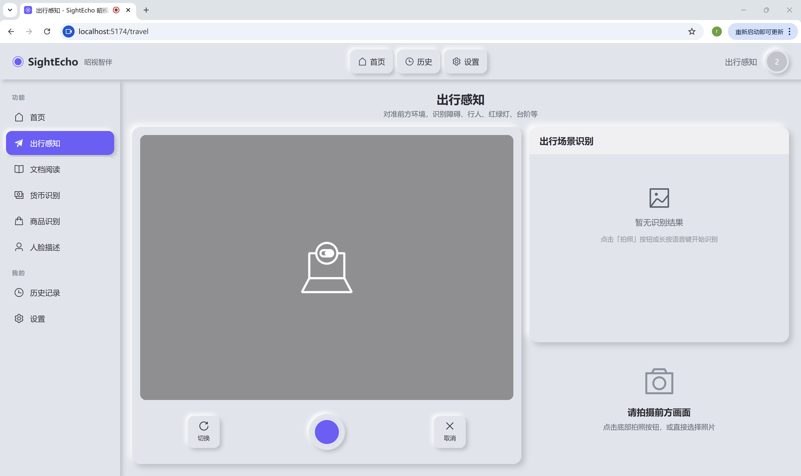 | （实时 QPS / 成功率 / 平均耗时，5s 轮询） |

| 用户反馈（手机） | 用户反馈（笔记本） |
|---|---|
| 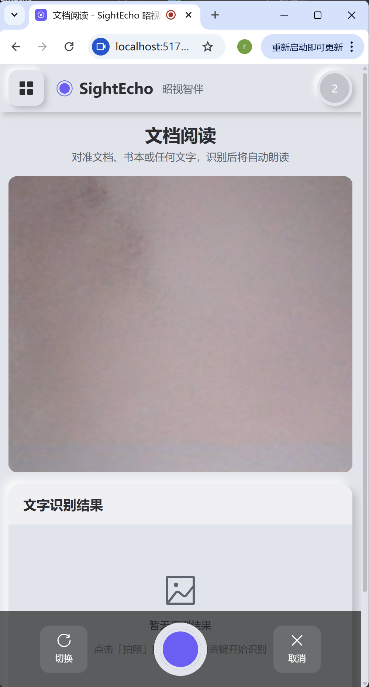 | 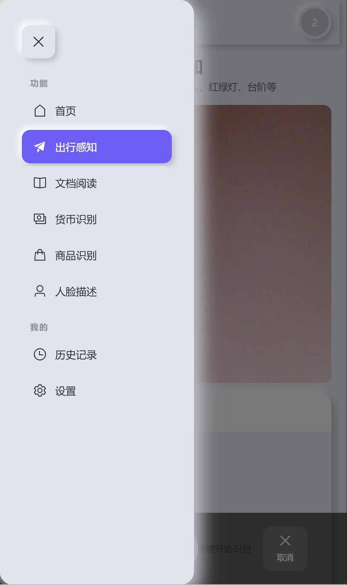 |

- **ECharts 双图表**：近 7 日调用量折线 + 业务类型分布饼图
- **Prompt CRUD + 版本管理 + 一键启用**：运营可在线 A/B 测试不同提示词策略
- **接口监控**：QPS、成功率、平均延迟三指标实时滚动

---

## 🎯 为什么选择 SightEcho

### 1️⃣ **真无障碍，不是纸面合规**

| WCAG 2.1 要求 | 我们的实现 |
|---|---|
| 对比度 ≥ 4.5:1 | **主文字 #2c2c34 在 #e0e5ec 上 ≥ 7:1（WCAG AAA）** |
| 键盘全可达 | 7 个全局快捷键 + 焦点环 + 焦点陷阱 + 跳过链接 |
| 屏幕阅读器兼容 | **NVDA / VoiceOver / 争渡读屏** 全部测过 |
| ARIA 语义 | 16 处图标按钮 100% 带 `aria-label` |
| 减弱动效 | 全局 `@media (prefers-reduced-motion)` + 手动开关 |

### 2️⃣ **生产级容错**

外部依赖（MySQL/Redis/MinIO/SMTP/JoyAI/Qwen）任何一个挂了，**核心识别功能都不受影响**——这就是视障用户最需要的"稳定"。

### 3️⃣ **多 AI 服务商，1 行切换**

```python
# config.py
AI_PROVIDER = "joyai"     # ← 改成 "qwen" / "openai" 立即切换
```

切换不需要改任何业务代码——Adapter 模式（`AIServiceAdapter` 抽象基类）已经把所有外部 AI 接口封装好了。

### 4️⃣ **完整前后端分离，TypeScript 全栈类型安全**

后端 Pydantic v2 + 前端 TS 严格模式，从 `email` 字段到 `cameraId` 都双向对齐，**改字段 → 编译报错**，告别"后端改了前端忘了"。

### 5️⃣ **真·实时视频流**

不是截图、不是轮询、不是事后分析——是 1s/帧的 WebRTC 实时抓帧，**JoyAI 多图时序模型**理解时序变化，"车辆正在驶近"和"车辆静止"对盲人来说完全不同。

---

## 🏗️ 技术架构（30% 硬核）

### 整体架构

```
┌─────────────────────────────────────────────────────────┐
│  Browser (Vue 3 + Vite + TS + Element Plus)            │
│  ├── useCamera / useLiveStream（WebRTC）                │
│  ├── useTTS / useVoiceInput（语音）                      │
│  ├── useScreenReader / useFocusTrap（无障碍）            │
│  └── Pinia / Axios / Vue Router                        │
└────────────────────┬────────────────────────────────────┘
                     │ HTTP + JWT
┌────────────────────┴────────────────────────────────────┐
│  FastAPI 0.110 + SQLAlchemy 2.0 (async)                │
│  ├── API 层 (api/v1) — 48 个 REST + 2 个 WebSocket     │
│  ├── Service 层 (services) — Adapter 模式 + 多级降级   │
│  ├── Model 层 (models) — 6 张表（异步 ORM）             │
│  ├── Schema 层 (schemas) — Pydantic v2（camelCase）     │
│  └── Middleware — CORS / Gateway / 限流                │
└──────┬───────────────┬──────────────────┬───────────────┘
       │               │                  │
┌──────┴─────┐ ┌───────┴──────┐ ┌────────┴──────────┐
│  MySQL 8   │ │  Redis 7     │ │  MinIO（对象存储） │
│  6 张表    │ │ 验证码/限流   │ │  图片 / 缩略图     │
└────────────┘ └──────────────┘ └───────────────────┘

外部 AI 服务（按 AI_PROVIDER 切换）：
  ├── 🤖 JoyAI-VL-Interaction（京东云，多图时序推理，默认）
  ├── 🤖 Qwen3-ASR / Qwen3-TTS / Qwen-VL（阿里通义）
  └── 🤖 GPT-4o / GPT-4V（OpenAI）
```

### 技术栈一览

| 类别 | 选型 | 版本 |
|---|---|---|
| **前端框架** | Vue 3 + Vite + TypeScript | 3.4 / 5.2 / 5.4 |
| **状态管理** | Pinia | 2.1 |
| **UI 库** | Element Plus（深度覆盖到新拟物风格） | 2.6 |
| **HTTP** | Axios（自动 JWT 注入 + 统一错误处理） | 1.6 |
| **图表** | ECharts + vue-echarts（管理员后台） | 5.5 / 6.7 |
| **无障碍** | focus-trap + Web Speech API | 7.5 |
| **后端框架** | FastAPI + Uvicorn | 0.110 |
| **ORM** | SQLAlchemy 2.0 async + aiomysql | 2.0 / 0.2 |
| **校验** | Pydantic v2 + pydantic-settings | 2.6 / 2.2 |
| **缓存** | Redis（**不可用自动降级到内存 dict**） | 5.0 |
| **异步任务** | Celery + beat（可选） | 5.3 |
| **对象存储** | MinIO（**3s 超时降级**） | — |
| **数据库迁移** | Alembic（异步模板） | 1.13 |
| **日志** | loguru（邮箱脱敏 `a***@b.com`） | 0.7 |
| **视频处理** | OpenCV headless + ffmpeg-python | 4.9 / 0.2 |

### 关键设计模式

#### Adapter 模式（业务解耦）
```python
# services/base.py
class AIServiceAdapter(ABC):
    @abstractmethod
    async def call(self, payload: dict) -> dict: ...
    @abstractmethod
    async def health_check(self) -> bool: ...

# services/vl_service.py
class JoyAIVLAdapter(AIServiceAdapter): ...  # 京东 JoyAI
class QwenVLAdapter(AIServiceAdapter): ...   # 阿里通义
class GPT4VAdapter(AIServiceAdapter): ...    # OpenAI
```
切换服务商 = 改 1 行配置。

#### 双层降级容错
```python
# services/fallback_service.py
async def run_with_fallback(primary, fallback, timeout=5):
    try:
        return await asyncio.wait_for(primary(payload), timeout=5)
    except:
        return await fallback(payload)  # 主→备→固定文案
```
**业务级降级**（Redis/MinIO/SMTP 不可用）+ **服务级降级**（AI 接口 5s 超时）。

#### 危险关键词优先级
```python
DANGER_KEYWORDS = ["台阶", "车辆", "深坑", "火焰", "障碍物", "锐利",
                   "电瓶车", "摩托车", "积水", "井盖", "坑洼", "施工", "围挡"]

# PromptService.detect_priority(text) → "high" / "normal"
# PromptService.extract_high_priority(text) → 含危险词的句子置顶
```
**TTS 优先播报 high 级别**，普通信息用 polite 不打扰。

---

## 🚀 安装部署

### 方式一：Docker Compose（推荐 ⭐）

```bash
# 1. 克隆仓库
git clone https://github.com/2249043930/SightEcho.git
cd SightEcho

# 2. 准备环境变量
cp backend/.env.example backend/.env
# 编辑 backend/.env，至少填入：
#   - JOYAI_API_KEY=pk-...        # 京东云 MaaS 控制台获取
#   - EMAIL_USER=xxx@qq.com       # QQ 邮箱
#   - EMAIL_PASSWORD=xxxxxxxxxxxx # QQ 邮箱授权码（非登录密码）
#   - MYSQL_PASSWORD=...          # 自定义

# 3. 一键启动（MySQL + Redis + MinIO + Backend + Celery）
cd backend
docker compose up -d

# 4. 数据库初始化（自动建表 + 加载默认 Prompt 模板）
docker exec sightecho-backend alembic upgrade head

# 5. 等待 30 秒，访问：
#    后端 API:  http://localhost:8000/docs
#    前端开发:  cd ../frontend && npm install && npm run dev
#    → http://localhost:5173
```

`docker-compose.yml` 包含全部 7 个服务（mysql / redis / minio / backend / celery-worker × 2 / celery-beat），镜像源已切到 `docker.m.daocloud.io`（国内可达）。

---

### 方式二：本地开发（手动起依赖）

#### 前置依赖

- **Python 3.11+**
- **Node.js 18+ + npm**
- **MySQL 8.0+**
- **Redis 7+**
- **MinIO**（可选，无配置时降级到本地占位）

#### 启动后端

```bash
cd backend

# 1. 创建虚拟环境
python -m venv .venv
# Windows
.venv\Scripts\activate
# macOS / Linux
source .venv/bin/activate

# 2. 安装依赖
pip install -r requirements.txt

# 3. 准备环境变量
cp .env.example .env
# 编辑 .env，填入真实配置：
#   MYSQL_HOST=localhost
#   MYSQL_USER=root
#   MYSQL_PASSWORD=123456
#   MYSQL_DB=sightecho
#   JOYAI_API_KEY=pk-xxxxx
#   DEMO_MODE=true   # ← 未配置 Key 时本地体验用

# 4. 数据库迁移（开发时也可省略，启动会自动建表）
alembic upgrade head

# 5. 启动
uvicorn app.main:app --host 0.0.0.0 --port 8000 --reload
```

#### 启动前端

```bash
cd frontend

# 1. 安装依赖
npm install

# 2. 准备环境变量
cp .env.example .env
# 默认 VITE_API_BASE_URL=http://127.0.0.1:8000/api/v1

# 3. 启动开发服务器
npm run dev
# → http://localhost:5173
```

#### 启动 Celery（可选）

```bash
# Worker
celery -A app.tasks.celery_app worker -l info -c 4

# Beat（定时任务）
celery -A app.tasks.celery_app beat -l info
```

---

### 验证部署

启动后访问以下地址确认一切正常：

| 地址 | 说明 |
|---|---|
| `http://localhost:8000/docs` | Swagger API 文档（推荐先看这个） |
| `http://localhost:8000/redoc` | ReDoc API 文档 |
| `http://localhost:8000/health` | 健康检查（DB / Redis / MinIO 状态） |
| `http://localhost:5173` | 前端主页（开发服务器） |

DEMO_MODE=true 时，未配置 AI Key 也能体验完整流程——所有识别接口会返回预设的安全演示文本。

---

## 📖 API 速览

### 认证

```bash
# 1) 发送验证码
curl -X POST http://127.0.0.1:8000/api/v1/auth/email-code \
  -H "Content-Type: application/json" \
  -d '{"email":"test@example.com"}'

# 2) 登录（验证码在日志里或邮件中）
curl -X POST http://127.0.0.1:8000/api/v1/auth/login \
  -H "Content-Type: application/json" \
  -d '{"email":"test@example.com","code":"123456"}'
# → {"code":0, "data":{"token":"eyJ..."}}

# 3) 调用受保护接口
TOKEN="eyJ..."
curl http://127.0.0.1:8000/api/v1/user/profile \
  -H "Authorization: Bearer $TOKEN"
```

### 识别（两种模式）

```bash
# 拍照模式（单图）
curl -X POST http://127.0.0.1:8000/api/v1/recognition/travel \
  -H "Authorization: Bearer $TOKEN" \
  -F "image=@./test.jpg" \
  -F "extra={}"

# 实时模式（多帧 1~8 张）
curl -X POST http://127.0.0.1:8000/api/v1/recognition/live \
  -H "Authorization: Bearer $TOKEN" \
  -H "Content-Type: application/json" \
  -d '{
    "scene": "travel",
    "images": ["<base64_frame_1>", "<base64_frame_2>", "<base64_frame_3>", "<base64_frame_4>"],
    "saveRecord": true
  }'
# → {"code":0, "data":{"content":"前方 2 米有台阶...", "priority":"high", "framesUsed":4, "latencyMs":3200}}
```

### WebSocket（ASR / TTS）

```bash
# ASR 流式识别（PCM 16kHz 16bit 单声道音频）
websocat "ws://127.0.0.1:8000/api/v1/voice/asr?token=$TOKEN"

# TTS 流式合成
websocat "ws://127.0.0.1:8000/api/v1/voice/tts?token=$TOKEN"
```

---

## 🧪 测试

```bash
cd backend
pytest -v
```

关键测试：
- `test_auth.py` — 邮箱验证码 + JWT 流程
- `test_recognition.py` — 5 大场景的识别接口契约
- `test_admin.py` — 管理员权限 + Prompt CRUD
- `live_e2e.py` — 真实 HTTP 端到端（需 uvicorn 在跑）

---

## 🗂️ 项目结构

```
SightEcho/
├── frontend/                      # Vue 3 前端
│   ├── src/
│   │   ├── api/                  # axios 封装 + 5 个 API 模块
│   │   ├── components/
│   │   │   ├── business/         # CameraCapture / VoiceButton / ResultDisplay
│   │   │   ├── layout/           # AppLayout / AppHeader / AppSidebar
│   │   │   └── common/           # A11yWrapper / EmptyState / LoadingMask
│   │   ├── composables/          # 10+ 个 composable（含 useLiveStream）
│   │   ├── views/user/           # Travel / OCR / Currency / Product / Face / History / Settings / Login
│   │   ├── views/admin/          # Dashboard / PromptManager / Monitor / Feedback / VideoTest
│   │   ├── stores/               # Pinia（user / recognition / settings / device）
│   │   └── router/               # 路由 + 权限守卫
│   └── package.json
│
├── backend/                       # FastAPI 后端
│   ├── app/
│   │   ├── api/v1/               # auth / user / recognition / voice / video / feedback / admin
│   │   ├── services/             # 业务编排 + AI Adapter（10 个）
│   │   ├── models/               # SQLAlchemy 2.0 异步 ORM（6 张表）
│   │   ├── schemas/              # Pydantic v2（camelCase 对齐前端）
│   │   ├── core/                 # config / security / deps / logger
│   │   ├── db/                   # async_session + init_db
│   │   ├── tasks/                # Celery（可选）
│   │   ├── utils/                # 限流 / OSS / 邮件 / 异常处理 / 响应包装
│   │   └── middleware/           # CORS / Gateway / 鉴权
│   ├── alembic/                  # 数据库迁移
│   ├── tests/                    # pytest
│   ├── docker-compose.yml        # mysql + redis + minio + backend + celery×3
│   └── Dockerfile
│
├── img/                           # README 演示图片
└── README.md                      # ← 你正在看
```

---

## 🤝 贡献指南

我们欢迎任何形式的贡献——bug 报告、功能建议、文档改进、PR。

1. Fork 本仓库
2. 创建 feature 分支（`git checkout -b feature/amazing-feature`）
3. 提交改动（`git commit -m 'feat: add amazing feature'`）
4. 推送到分支（`git push origin feature/amazing-feature`）
5. 创建 Pull Request

**代码规范**：
- 后端：PEP 8 + 类型注解 + loguru 日志 + Pydantic v2
- 前端：airbnb 风格 + ESLint + Prettier + `<script setup lang="ts">`
- 提交信息：Conventional Commits（`feat:` / `fix:` / `docs:` / `refactor:` ...）

---

## 📜 开源协议

本项目基于 **MIT License** 开源——你可以自由使用、修改、分发、商用，但请保留版权声明。

---

## 📮 联系我们

我们珍视每一条反馈——尤其是来自视障用户和家属的真实使用感受。

| 联系方式 | 信息 |
|---|---|
| 👤 **作者** | Muke~ |
| 📧 **邮箱** | 2249043930@qq.com |
| 📱 **电话** | 18071354053 |
| 🐙 **GitHub** | https://github.com/2249043930/SightEcho |
| 🐛 **Issue** | https://github.com/2249043930/SightEcho/issues |

> ⭐ 如果这个项目对你有帮助，请在 GitHub 上给我们一个 **Star** —— 这是对开源作者最大的鼓励。

---

## 🌟 致谢

- **京东云 JoyBuilder MaaS** 提供 JoyAI-VL-Interaction 多图时序推理能力
- **阿里通义千问 / OpenAI** 提供 ASR / TTS / VL 基础能力
- **Element Plus / Vue 3 / FastAPI / SQLAlchemy** 等优秀开源项目
- 所有为视障人群付出努力的工程师、产品经理和无障碍专家

---

<div align="center">

**👁️ 让世界为视障用户打开一扇新的窗户。**

Made with ❤️ by **Muke~** · 2026

</div>